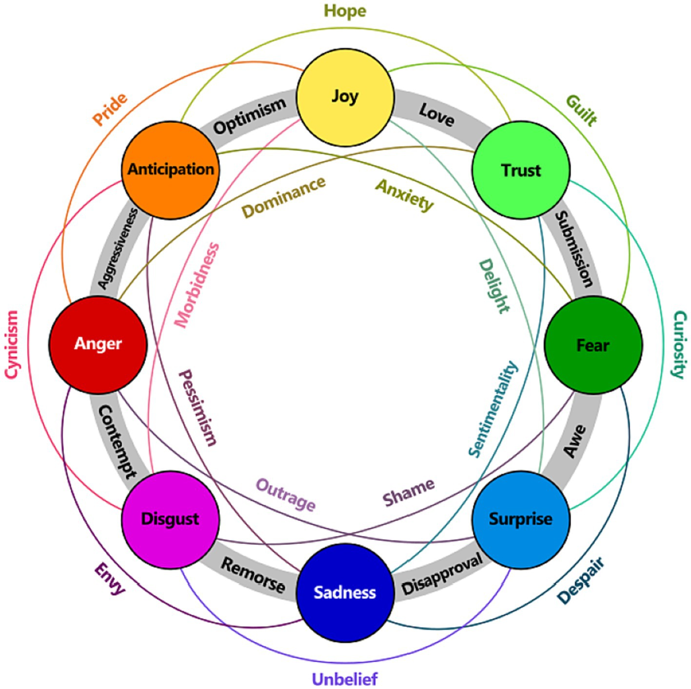
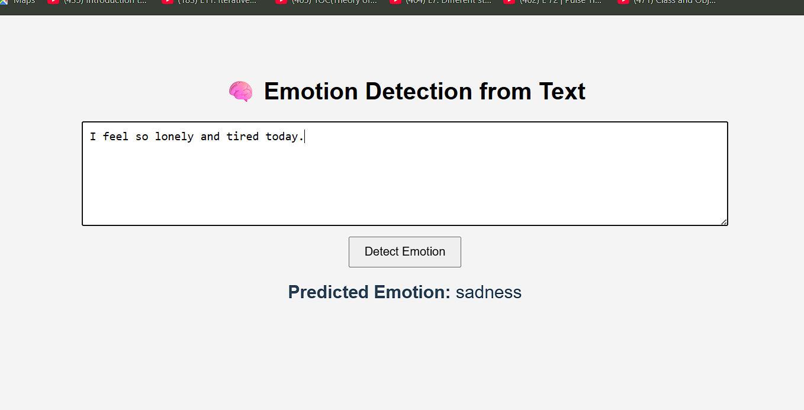

# 😃 Emotion Detection from Text (Machine Learning + Flask App)

This project performs **emotion classification** of text using traditional machine learning models. It includes both:

- A **Jupyter Notebook** for training, evaluating, and saving the model
- A simple **Flask Web App** to interactively predict emotions from user input
<br>
<br>

  

---

## 📌 Project Features

### 🧪 Machine Learning Notebook (`Emotion-Detection.ipynb`)
- Text cleaning and preprocessing (stopwords, punctuation, emojis)
- Keyword extraction per emotion
- Emotion classification using:
  - Naive Bayes
  - Logistic Regression
  - K-Nearest Neighbors (KNN)
  - Decision Tree
- WordCloud visualizations
- Model comparison
- Model export as `.pkl`

### 🌐 Flask Web App (`app.py`)
- Input a sentence on the web
- Backend uses saved model and vectorizer
- Real-time emotion prediction

---

## 📁 Project Structure

Emotion-Detection-Project/<br>
├── Emotion-Detection.ipynb  (Jupyter notebook for training and evaluation)<br>
├── app.py  (Flask app for interactive prediction)<br>
├── emotion_model.pkl  (Trained ML model (saved from notebook))<br>
├── vectorizer.pkl  (TF-IDF or CountVectorizer)<br>
├── templates/index.html  (Frontend UI for the Flask app)<br>
├── requirements.txt  (Python dependencies)<br>
└── README.md  (This file)<br>

---


---

## 🚀 How to Run the Project

### 🔧 1. Install Required Packages

```bash
pip install -r requirements.txt
```
If you don’t have requirements.txt, manually install:
```bash
pip install flask scikit-learn nltk
```
```python
import nltk
nltk.download('stopwords')
```

---
### 🧠 2. Train and Export the Model (from Notebook)
1. Open `Emotion-Detection.ipynb` in Jupyter Notebook

2. Run the notebook cells step-by-step

3. At the end, it will generate:

  - `emotion_model.pkl`

  - `vectorizer.pkl`


---

### 🌐 3. Run the Web App (From Terminal)
```bash
python app.py
```
Then go to:
👉 `http://127.0.0.1:5000` in your browser
Type in a sentence and see its predicted emotion in real-time.

---

## 📊 Sample Prediction
Input: "I feel so lonely and tired today."<br>
Output: Predicted Emotion: `sad`



---

## 📄 License
This project is open-source and available under the MIT License.

---
### 🙋‍♂️ Author
Pankaj Kumar<br>
GitHub: [@PankajKumar-11](https://github.com/PankajKumar-11)


